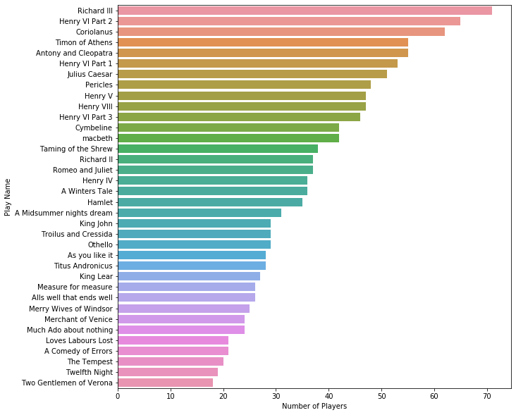
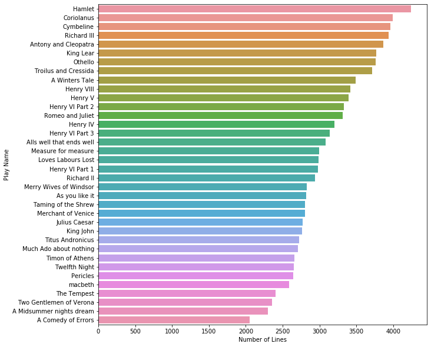

# To be, or not to be

This project is a part of course EECS731. In this project we will build classification models and also feature engineering which would help the data set to establish additional value using exploratory data analysis.

This project structure is cloned from [Cookiecutter](https://drivendata.github.io/cookiecutter-data-science/)


Steps followed are :
   - Installing cookiecutter. Run the command 
    
    pip install cookiecutter
   - Then, run the below command from terminal to load the project structure

    cookiecutter https://github.com/drivendata/cookiecutter-data-science

Dataset considered here is **"Shakespeare play data"**

Path to Shakespeare data --> /data/external/Shakespeare_data.csv

Raw data collected from :-

  - Shakespeare_data.csv is taken from [here](https://www.kaggle.com/kingburrito666/shakespeare-plays) - Kaggle


## Data exploration and Basic Hygiene :
    
```python
import pandas as pd
import numpy as np
import seaborn as sns
import matplotlib.pyplot as plt
df = pd.read_csv('../data/external/Shakespeare_data.csv')
```


```python
df.head()
```


<table border="1" class="dataframe">
  <thead>
    <tr style="text-align: right;">
      <th></th>
      <th>Dataline</th>
      <th>Play</th>
      <th>PlayerLinenumber</th>
      <th>ActSceneLine</th>
      <th>Player</th>
      <th>PlayerLine</th>
    </tr>
  </thead>
  <tbody>
    <tr>
      <td>0</td>
      <td>1</td>
      <td>Henry IV</td>
      <td>NaN</td>
      <td>NaN</td>
      <td>NaN</td>
      <td>ACT I</td>
    </tr>
    <tr>
      <td>1</td>
      <td>2</td>
      <td>Henry IV</td>
      <td>NaN</td>
      <td>NaN</td>
      <td>NaN</td>
      <td>SCENE I. London. The palace.</td>
    </tr>
    <tr>
      <td>2</td>
      <td>3</td>
      <td>Henry IV</td>
      <td>NaN</td>
      <td>NaN</td>
      <td>NaN</td>
      <td>Enter KING HENRY, LORD JOHN OF LANCASTER, the ...</td>
    </tr>
    <tr>
      <td>3</td>
      <td>4</td>
      <td>Henry IV</td>
      <td>1.0</td>
      <td>1.1.1</td>
      <td>KING HENRY IV</td>
      <td>So shaken as we are, so wan with care,</td>
    </tr>
    <tr>
      <td>4</td>
      <td>5</td>
      <td>Henry IV</td>
      <td>1.0</td>
      <td>1.1.2</td>
      <td>KING HENRY IV</td>
      <td>Find we a time for frighted peace to pant,</td>
    </tr>
  </tbody>
</table>
</div>


```python
df.info()
```

    <class 'pandas.core.frame.DataFrame'>
    RangeIndex: 111396 entries, 0 to 111395
    Data columns (total 6 columns):
    Dataline            111396 non-null int64
    Play                111396 non-null object
    PlayerLinenumber    111393 non-null float64
    ActSceneLine        105153 non-null object
    Player              111389 non-null object
    PlayerLine          111396 non-null object
    dtypes: float64(1), int64(1), object(4)
    memory usage: 5.1+ MB


```python
df['Player'].replace(np.nan, 'Other',inplace = True)
df.head(5)
```


<table border="1" class="dataframe">
  <thead>
    <tr style="text-align: right;">
      <th></th>
      <th>Dataline</th>
      <th>Play</th>
      <th>PlayerLinenumber</th>
      <th>ActSceneLine</th>
      <th>Player</th>
      <th>PlayerLine</th>
    </tr>
  </thead>
  <tbody>
    <tr>
      <td>0</td>
      <td>1</td>
      <td>Henry IV</td>
      <td>NaN</td>
      <td>NaN</td>
      <td>Other</td>
      <td>ACT I</td>
    </tr>
    <tr>
      <td>1</td>
      <td>2</td>
      <td>Henry IV</td>
      <td>NaN</td>
      <td>NaN</td>
      <td>Other</td>
      <td>SCENE I. London. The palace.</td>
    </tr>
    <tr>
      <td>2</td>
      <td>3</td>
      <td>Henry IV</td>
      <td>NaN</td>
      <td>NaN</td>
      <td>Other</td>
      <td>Enter KING HENRY, LORD JOHN OF LANCASTER, the ...</td>
    </tr>
    <tr>
      <td>3</td>
      <td>4</td>
      <td>Henry IV</td>
      <td>1.0</td>
      <td>1.1.1</td>
      <td>KING HENRY IV</td>
      <td>So shaken as we are, so wan with care,</td>
    </tr>
    <tr>
      <td>4</td>
      <td>5</td>
      <td>Henry IV</td>
      <td>1.0</td>
      <td>1.1.2</td>
      <td>KING HENRY IV</td>
      <td>Find we a time for frighted peace to pant,</td>
    </tr>
  </tbody>
</table>
</div>


```python
print("Number of plays are: " + str(df['Play'].nunique()))
```

    Number of plays are: 36


```python
#Finding and plotting number of players per play
pd.DataFrame(df['Play'].unique().tolist(), columns=['Play Name'])
Playersperplay = df.groupby(['Play'])['Player'].nunique().sort_values(ascending= False).to_frame()
Playersperplay['Play'] = Playersperplay.index.tolist()
Playersperplay.columns = ['Num Players','Play']
Playersperplay.index= np.arange(0,len(Playersperplay))
plt.figure(figsize=(10,10))
ax = sns.barplot(x='Num Players',y='Play',data=Playersperplay)
ax.set(xlabel='Number of Players', ylabel='Play Name')
plt.show()
```

### Below plot shows number of players per play




```python
#Finding and plotting number of lines in each play
play_data = df.groupby('Play').count().sort_values(by='PlayerLine',ascending=False)['PlayerLine']
play_data = play_data.to_frame()
play_data['Play'] = play_data.index.tolist()
play_data.index = np.arange(0,len(play_data)) #changing the index from plays to numbers
play_data.columns =['Lines','Play']
play_data
```


<table border="1" class="dataframe">
  <thead>
    <tr style="text-align: right;">
      <th></th>
      <th>Lines</th>
      <th>Play</th>
    </tr>
  </thead>
  <tbody>
    <tr>
      <td>0</td>
      <td>4244</td>
      <td>Hamlet</td>
    </tr>
    <tr>
      <td>1</td>
      <td>3992</td>
      <td>Coriolanus</td>
    </tr>
    <tr>
      <td>2</td>
      <td>3958</td>
      <td>Cymbeline</td>
    </tr>
    <tr>
      <td>3</td>
      <td>3941</td>
      <td>Richard III</td>
    </tr>
    <tr>
      <td>4</td>
      <td>3862</td>
      <td>Antony and Cleopatra</td>
    </tr>
    <tr>
      <td>5</td>
      <td>3766</td>
      <td>King Lear</td>
    </tr>
    <tr>
      <td>6</td>
      <td>3762</td>
      <td>Othello</td>
    </tr>
    <tr>
      <td>7</td>
      <td>3711</td>
      <td>Troilus and Cressida</td>
    </tr>
    <tr>
      <td>8</td>
      <td>3489</td>
      <td>A Winters Tale</td>
    </tr>
    <tr>
      <td>9</td>
      <td>3419</td>
      <td>Henry VIII</td>
    </tr>
    <tr>
      <td>10</td>
      <td>3395</td>
      <td>Henry V</td>
    </tr>
    <tr>
      <td>11</td>
      <td>3334</td>
      <td>Henry VI Part 2</td>
    </tr>
    <tr>
      <td>12</td>
      <td>3313</td>
      <td>Romeo and Juliet</td>
    </tr>
    <tr>
      <td>13</td>
      <td>3205</td>
      <td>Henry IV</td>
    </tr>
    <tr>
      <td>14</td>
      <td>3138</td>
      <td>Henry VI Part 3</td>
    </tr>
    <tr>
      <td>15</td>
      <td>3083</td>
      <td>Alls well that ends well</td>
    </tr>
    <tr>
      <td>16</td>
      <td>2998</td>
      <td>Measure for measure</td>
    </tr>
    <tr>
      <td>17</td>
      <td>2986</td>
      <td>Loves Labours Lost</td>
    </tr>
    <tr>
      <td>18</td>
      <td>2983</td>
      <td>Henry VI Part 1</td>
    </tr>
    <tr>
      <td>19</td>
      <td>2937</td>
      <td>Richard II</td>
    </tr>
    <tr>
      <td>20</td>
      <td>2831</td>
      <td>Merry Wives of Windsor</td>
    </tr>
    <tr>
      <td>21</td>
      <td>2822</td>
      <td>As you like it</td>
    </tr>
    <tr>
      <td>22</td>
      <td>2806</td>
      <td>Taming of the Shrew</td>
    </tr>
    <tr>
      <td>23</td>
      <td>2802</td>
      <td>Merchant of Venice</td>
    </tr>
    <tr>
      <td>24</td>
      <td>2771</td>
      <td>Julius Caesar</td>
    </tr>
    <tr>
      <td>25</td>
      <td>2766</td>
      <td>King John</td>
    </tr>
    <tr>
      <td>26</td>
      <td>2726</td>
      <td>Titus Andronicus</td>
    </tr>
    <tr>
      <td>27</td>
      <td>2704</td>
      <td>Much Ado about nothing</td>
    </tr>
    <tr>
      <td>28</td>
      <td>2662</td>
      <td>Timon of Athens</td>
    </tr>
    <tr>
      <td>29</td>
      <td>2648</td>
      <td>Twelfth Night</td>
    </tr>
    <tr>
      <td>30</td>
      <td>2641</td>
      <td>Pericles</td>
    </tr>
    <tr>
      <td>31</td>
      <td>2586</td>
      <td>macbeth</td>
    </tr>
    <tr>
      <td>32</td>
      <td>2403</td>
      <td>The Tempest</td>
    </tr>
    <tr>
      <td>33</td>
      <td>2357</td>
      <td>Two Gentlemen of Verona</td>
    </tr>
    <tr>
      <td>34</td>
      <td>2300</td>
      <td>A Midsummer nights dream</td>
    </tr>
    <tr>
      <td>35</td>
      <td>2055</td>
      <td>A Comedy of Errors</td>
    </tr>
  </tbody>
</table>
</div>


```python
plt.figure(figsize=(10,10))
ax= sns.barplot(x='Lines',y='Play',data=play_data, order = play_data['Play'])
ax.set(xlabel='Number of Lines', ylabel='Play Name')
plt.show()
```
### Below plot shows Number of lines in each play




```python
#Number of lines spoken per player in each play
lines_per_player= df.groupby(['Play','Player']).count()['PlayerLine']
lines_per_player= lines_per_player.to_frame()
lines_per_player
```


### Below is the data of number of lines spoken per player in each play

<table border="1" class="dataframe">
  <thead>
    <tr style="text-align: right;">
      <th></th>
      <th></th>
      <th>PlayerLine</th>
    </tr>
    <tr>
      <th>Play</th>
      <th>Player</th>
      <th></th>
    </tr>
  </thead>
  <tbody>
    <tr>
      <td rowspan="5" valign="top">A Comedy of Errors</td>
      <td>ADRIANA</td>
      <td>284</td>
    </tr>
    <tr>
      <td>AEGEON</td>
      <td>150</td>
    </tr>
    <tr>
      <td>AEMELIA</td>
      <td>75</td>
    </tr>
    <tr>
      <td>ANGELO</td>
      <td>99</td>
    </tr>
    <tr>
      <td>ANTIPHOLUS</td>
      <td>6</td>
    </tr>
    <tr>
      <td>...</td>
      <td>...</td>
      <td>...</td>
    </tr>
    <tr>
      <td rowspan="5" valign="top">macbeth</td>
      <td>Son</td>
      <td>24</td>
    </tr>
    <tr>
      <td>Third Apparition</td>
      <td>6</td>
    </tr>
    <tr>
      <td>Third Murderer</td>
      <td>8</td>
    </tr>
    <tr>
      <td>Third Witch</td>
      <td>27</td>
    </tr>
    <tr>
      <td>YOUNG SIWARD</td>
      <td>8</td>
    </tr>
  </tbody>
</table>
<p>1328 rows × 1 columns</p>
</div>

## Feature Engineering


```python
#Feature Engineering
df.loc[1]['PlayerLine']
```


    'SCENE I. London. The palace.'


#### Below we are converting all the text into lower case

```python
#Lower casing the text
df['PlayerLine_parsed'] = df['PlayerLine'].str.lower()
```
#### Removing the punctuations

```python
#getting rid of punctuations
punctuation_signs = list("?:!.,;")
df['PlayerLine_parsed_2'] = df['PlayerLine_parsed']

for punct_sign in punctuation_signs:
    df['PlayerLine_parsed_2'] = df['PlayerLine_parsed_2'].str.replace(punct_sign, '')
```
#### Removing possessive pronoun terminations

```python
#remove possessive pronoun terminations
df['PlayerLine_parsed_3'] = df['PlayerLine_parsed_2'].str.replace("'s", "")
```

#### Lemmitization - Lemmatization is the process of grouping together the different inflected forms of a word so they can be analysed as a single item.

```python
#Lemmitization
import nltk
from nltk.corpus import stopwords
from nltk.stem import WordNetLemmatizer
nltk.download('punkt')
nltk.download('wordnet')
```

    [nltk_data] Downloading package punkt to
    [nltk_data]     /Users/mugdhabajjuri/nltk_data...
    [nltk_data]   Package punkt is already up-to-date!
    [nltk_data] Downloading package wordnet to
    [nltk_data]     /Users/mugdhabajjuri/nltk_data...
    [nltk_data]   Package wordnet is already up-to-date!


    True


```python
# Saving the lemmatizer into an object
wordnet_lemmatizer = WordNetLemmatizer()
```


```python
#In order to lemmatize, we have to iterate through every word:

nrows = len(df)
lemmatized_text_list = []

for row in range(0, nrows):
    
    # Create an empty list containing lemmatized words
    lemmatized_list = []
    
    # Save the text and its words into an object
    text = df.loc[row]['PlayerLine_parsed_3']
    text_words = text.split(" ")

    # Iterate through every word to lemmatize
    for word in text_words:
        lemmatized_list.append(wordnet_lemmatizer.lemmatize(word, pos="v"))
        
    # Join the list
    lemmatized_text = " ".join(lemmatized_list)
    
    # Append to the list containing the texts
    lemmatized_text_list.append(lemmatized_text)
```


```python
df['PlayerLine_parsed_4'] = lemmatized_text_list
```

####  Removing stop words. stop words are commonly used words, which can be ignored

```python
#stop words
nltk.download('stopwords')
```

    [nltk_data] Downloading package stopwords to
    [nltk_data]     /Users/mugdhabajjuri/nltk_data...
    [nltk_data]   Package stopwords is already up-to-date!


    True


```python
# Loading the stop words in english
stop_words = list(stopwords.words('english'))
```


```python
stop_words[0:10]
```


    ['i', 'me', 'my', 'myself', 'we', 'our', 'ours', 'ourselves', 'you', "you're"]


```python
df['PlayerLine_parsed_5'] = df['PlayerLine_parsed_4']

for stop_word in stop_words:

    regex_stopword = r"\b" + stop_word + r"\b"
    df['PlayerLine_parsed_5'] = df['PlayerLine_parsed_5'].str.replace(regex_stopword, '')


```


```python
df.head(5)
```


<table border="1" class="dataframe">
  <thead>
    <tr style="text-align: right;">
      <th></th>
      <th>Dataline</th>
      <th>Play</th>
      <th>PlayerLinenumber</th>
      <th>ActSceneLine</th>
      <th>Player</th>
      <th>PlayerLine</th>
      <th>PlayerLine_parsed</th>
      <th>PlayerLine_parsed_2</th>
      <th>PlayerLine_parsed_3</th>
      <th>PlayerLine_parsed_4</th>
      <th>PlayerLine_parsed_5</th>
    </tr>
  </thead>
  <tbody>
    <tr>
      <td>0</td>
      <td>1</td>
      <td>Henry IV</td>
      <td>NaN</td>
      <td>NaN</td>
      <td>Other</td>
      <td>ACT I</td>
      <td>act i</td>
      <td>act i</td>
      <td>act i</td>
      <td>act i</td>
      <td>act</td>
    </tr>
    <tr>
      <td>1</td>
      <td>2</td>
      <td>Henry IV</td>
      <td>NaN</td>
      <td>NaN</td>
      <td>Other</td>
      <td>SCENE I. London. The palace.</td>
      <td>scene i. london. the palace.</td>
      <td>scene i london the palace</td>
      <td>scene i london the palace</td>
      <td>scene i london the palace</td>
      <td>scene  london  palace</td>
    </tr>
    <tr>
      <td>2</td>
      <td>3</td>
      <td>Henry IV</td>
      <td>NaN</td>
      <td>NaN</td>
      <td>Other</td>
      <td>Enter KING HENRY, LORD JOHN OF LANCASTER, the ...</td>
      <td>enter king henry, lord john of lancaster, the ...</td>
      <td>enter king henry lord john of lancaster the ea...</td>
      <td>enter king henry lord john of lancaster the ea...</td>
      <td>enter king henry lord john of lancaster the ea...</td>
      <td>enter king henry lord john  lancaster  earl  w...</td>
    </tr>
    <tr>
      <td>3</td>
      <td>4</td>
      <td>Henry IV</td>
      <td>1.0</td>
      <td>1.1.1</td>
      <td>KING HENRY IV</td>
      <td>So shaken as we are, so wan with care,</td>
      <td>so shaken as we are, so wan with care,</td>
      <td>so shaken as we are so wan with care</td>
      <td>so shaken as we are so wan with care</td>
      <td>so shake as we be so wan with care</td>
      <td>shake     wan  care</td>
    </tr>
    <tr>
      <td>4</td>
      <td>5</td>
      <td>Henry IV</td>
      <td>1.0</td>
      <td>1.1.2</td>
      <td>KING HENRY IV</td>
      <td>Find we a time for frighted peace to pant,</td>
      <td>find we a time for frighted peace to pant,</td>
      <td>find we a time for frighted peace to pant</td>
      <td>find we a time for frighted peace to pant</td>
      <td>find we a time for fright peace to pant</td>
      <td>find   time  fright peace  pant</td>
    </tr>
  </tbody>
</table>
</div>


```python
to_drop = ['PlayerLine_parsed','PlayerLine_parsed_2', 'PlayerLine_parsed_3','PlayerLine_parsed_4']
df.drop(to_drop, inplace=True, axis=1)
```


```python
df = df.rename(columns={'PlayerLine_parsed_5': 'PlayerLine_parsed'})
```

#### Final cleaned table

```python
df.head()
```


<table border="1" class="dataframe">
  <thead>
    <tr style="text-align: right;">
      <th></th>
      <th>Dataline</th>
      <th>Play</th>
      <th>PlayerLinenumber</th>
      <th>ActSceneLine</th>
      <th>Player</th>
      <th>PlayerLine</th>
      <th>PlayerLine_parsed</th>
    </tr>
  </thead>
  <tbody>
    <tr>
      <td>0</td>
      <td>1</td>
      <td>Henry IV</td>
      <td>NaN</td>
      <td>NaN</td>
      <td>Other</td>
      <td>ACT I</td>
      <td>act</td>
    </tr>
    <tr>
      <td>1</td>
      <td>2</td>
      <td>Henry IV</td>
      <td>NaN</td>
      <td>NaN</td>
      <td>Other</td>
      <td>SCENE I. London. The palace.</td>
      <td>scene  london  palace</td>
    </tr>
    <tr>
      <td>2</td>
      <td>3</td>
      <td>Henry IV</td>
      <td>NaN</td>
      <td>NaN</td>
      <td>Other</td>
      <td>Enter KING HENRY, LORD JOHN OF LANCASTER, the ...</td>
      <td>enter king henry lord john  lancaster  earl  w...</td>
    </tr>
    <tr>
      <td>3</td>
      <td>4</td>
      <td>Henry IV</td>
      <td>1.0</td>
      <td>1.1.1</td>
      <td>KING HENRY IV</td>
      <td>So shaken as we are, so wan with care,</td>
      <td>shake     wan  care</td>
    </tr>
    <tr>
      <td>4</td>
      <td>5</td>
      <td>Henry IV</td>
      <td>1.0</td>
      <td>1.1.2</td>
      <td>KING HENRY IV</td>
      <td>Find we a time for frighted peace to pant,</td>
      <td>find   time  fright peace  pant</td>
    </tr>
  </tbody>
</table>
</div>

## Encoding


```python
#Machine learning models require numeric features and labels to provide a prediction. For this reason we must create a dictionary to map each label to a numerical ID. 
#Here labels are Players

players = df.Player.unique()
i=0
Player_codes = dict()
for player in players:
    Player_codes[player]=i
    i=i+1
```


```python
plays = df.Play.unique()
j=0
Play_codes = dict()
for play in plays:
    Play_codes[play]=j
    j=j+1
```


```python
PlayerLinenumbers = df.PlayerLinenumber.unique()
k=0.01
PlayerLinenumber_codes = dict()
for PlayerLinenumber in PlayerLinenumbers:
    PlayerLinenumber_codes[PlayerLinenumber]=k
    k=k+1
```


```python
ActSceneLines = df.ActSceneLine.unique()
j=0
ActSceneLine_codes = dict()
for ActSceneLine in ActSceneLines:
    ActSceneLine_codes[ActSceneLine]=j
    j=j+1
```


```python
df['Player_code'] = df['Player']
df = df.replace({'Player_code':Player_codes})
```


```python
df['Play_code'] = df['Play']
df = df.replace({'Play_code':Play_codes})
```


```python
df['PlayerLinenumber_code'] = df['PlayerLinenumber']
df = df.replace({'PlayerLinenumber_code':PlayerLinenumber_codes})
```


```python
df['ActSceneLine_code'] = df['ActSceneLine']
df = df.replace({'ActSceneLine_code':ActSceneLine_codes})
```


```python
df.head()
```


<table border="1" class="dataframe">
  <thead>
    <tr style="text-align: right;">
      <th></th>
      <th>Dataline</th>
      <th>Play</th>
      <th>PlayerLinenumber</th>
      <th>ActSceneLine</th>
      <th>Player</th>
      <th>PlayerLine</th>
      <th>PlayerLine_parsed</th>
      <th>Player_code</th>
      <th>Play_code</th>
      <th>PlayerLinenumber_code</th>
      <th>ActSceneLine_code</th>
    </tr>
  </thead>
  <tbody>
    <tr>
      <td>0</td>
      <td>1</td>
      <td>Henry IV</td>
      <td>NaN</td>
      <td>NaN</td>
      <td>Other</td>
      <td>ACT I</td>
      <td>act</td>
      <td>0</td>
      <td>0</td>
      <td>0.01</td>
      <td>0</td>
    </tr>
    <tr>
      <td>1</td>
      <td>2</td>
      <td>Henry IV</td>
      <td>NaN</td>
      <td>NaN</td>
      <td>Other</td>
      <td>SCENE I. London. The palace.</td>
      <td>scene  london  palace</td>
      <td>0</td>
      <td>0</td>
      <td>0.01</td>
      <td>0</td>
    </tr>
    <tr>
      <td>2</td>
      <td>3</td>
      <td>Henry IV</td>
      <td>NaN</td>
      <td>NaN</td>
      <td>Other</td>
      <td>Enter KING HENRY, LORD JOHN OF LANCASTER, the ...</td>
      <td>enter king henry lord john  lancaster  earl  w...</td>
      <td>0</td>
      <td>0</td>
      <td>0.01</td>
      <td>0</td>
    </tr>
    <tr>
      <td>3</td>
      <td>4</td>
      <td>Henry IV</td>
      <td>1.0</td>
      <td>1.1.1</td>
      <td>KING HENRY IV</td>
      <td>So shaken as we are, so wan with care,</td>
      <td>shake     wan  care</td>
      <td>1</td>
      <td>0</td>
      <td>1.01</td>
      <td>1</td>
    </tr>
    <tr>
      <td>4</td>
      <td>5</td>
      <td>Henry IV</td>
      <td>1.0</td>
      <td>1.1.2</td>
      <td>KING HENRY IV</td>
      <td>Find we a time for frighted peace to pant,</td>
      <td>find   time  fright peace  pant</td>
      <td>1</td>
      <td>0</td>
      <td>1.01</td>
      <td>2</td>
    </tr>
  </tbody>
</table>
</div>


## Text representation

#### TF-IDF vectorization

```python
#Vectorizing Player line using tfidf
from sklearn.feature_extraction.text import TfidfVectorizer
ngram_range = (1,2)
#ignoring terms that appear in less than 5 docs
min_df = 5
#ignoring terms that appear in more than 50% of docs
max_df = 0.50
max_features = 100
tfidf = TfidfVectorizer(encoding='utf-8', ngram_range=ngram_range,
                        stop_words=None,
                        lowercase=False,
                        max_df=max_df,
                        min_df=min_df,
                        max_features=max_features,
                        norm='l2',
                        sublinear_tf=True )
                        
features_train = tfidf.fit_transform(df.PlayerLine_parsed).toarray()
print(features_train.shape)
```

    (111396, 100)

## Train - test split

```python


#Spliting the dataset to form train and test sets
vecdf = pd.DataFrame(features_train) 
vecdf['Playcode'] = df['Play_code']
vecdf['ActSceneLine_code'] = df['ActSceneLine_code']
vecdf['PlayerLinenumber_code'] = df['PlayerLinenumber_code']
X = np.asarray(vecdf)
y = np.asarray(df['Player_code'])
from sklearn.model_selection import train_test_split
X_train, X_test, y_train, y_test = train_test_split(X, y, test_size=0.2)
print (X_train.shape, y_train.shape)
print (X_test.shape, y_test.shape)
```

    (89116, 103) (89116,)
    (22280, 103) (22280,)

## Decision Tree Classifier

```python
from sklearn.tree import DecisionTreeClassifier # Import Decision Tree Classifier
clf = DecisionTreeClassifier()

# Train Decision Tree Classifer
clf = clf.fit(X_train, y_train)

#Predict the response for dataset
print('Accuracy of Decision Tree classifier on training set: {:.2f}'
     .format(clf.score(X_train, y_train)))
print('Accuracy of Decision Tree classifier on test set: {:.2f}'
     .format(clf.score(X_test, y_test)))
```

#### Accuracy

    Accuracy of Decision Tree classifier on training set: 0.99
    Accuracy of Decision Tree classifier on test set: 0.72

## K Neighbors Classifier

```python
from sklearn.neighbors import KNeighborsClassifier
knn = KNeighborsClassifier()
knn.fit(X_train, y_train)
print('Accuracy of K-NN classifier on training set: {:.2f}'
     .format(knn.score(X_train, y_train)))
print('Accuracy of K-NN classifier on test set: {:.2f}'
     .format(knn.score(X_test, y_test)))
```

#### Accuracy

    Accuracy of K-NN classifier on training set: 0.78
    Accuracy of K-NN classifier on test set: 0.61

## Gaussian Naive Bayes Classifier

```python
from sklearn.naive_bayes import GaussianNB
nb = GaussianNB()
nb.fit(X_train, y_train)
print('Accuracy of Naive bayes classifier on training set: {:.2f}'
     .format(knn.score(X_train, y_train)))
print('Accuracy of Naive bayes classifier on test set: {:.2f}'
     .format(knn.score(X_test, y_test)))
```
#### Accuracy

    Accuracy of Naive bayes classifier on training set: 0.78
    Accuracy of Naive bayes classifier on test set: 0.61

## Count Vectorization

```python
from sklearn.feature_extraction.text import CountVectorizer
cvec = CountVectorizer(input='content', encoding='utf-8', 
                       decode_error='strict',
                       analyzer='word', max_df= max_df, min_df= min_df
                        )
features_train1 = cvec.fit_transform(df.PlayerLine_parsed).toarray()
print(features_train1.shape)
```

    (111396, 6614)


```python
#Spliting the dataset to form train and test sets
vecdf = pd.DataFrame(features_train1) 
vecdf['Playcode'] = df['Play_code']
vecdf['ActSceneLine_code'] = df['ActSceneLine_code']
vecdf['PlayerLinenumber_code'] = df['PlayerLinenumber_code']
X = np.asarray(vecdf)
y = np.asarray(df['Player_code'])
from sklearn.model_selection import train_test_split
xTrain1, xTest1, yTrain1, yTest1 = train_test_split(X, y, test_size=0.2)
print (xTrain1.shape, yTrain1.shape)
print (xTest1.shape, yTest1.shape)
```

    (89116, 6617) (89116,)
    (22280, 6617) (22280,)


## Decision Tree Classifier (with Count Vectorization)

```python
from sklearn.tree import DecisionTreeClassifier # Import Decision Tree Classifier
clf = DecisionTreeClassifier()

# Train Decision Tree Classifer
clf = clf.fit(xTrain1, yTrain1)
#Predict the response for dataset
print('Accuracy of Decision Tree classifier on training set: {:.2f}'
     .format(clf.score(xTrain1, yTrain1)))
print('Accuracy of Decision Tree classifier on test set: {:.2f}'
     .format(clf.score(xTest1, yTest1)))
```

#### Accuracy

    Accuracy of Decision Tree classifier on training set: 1.00
    Accuracy of Decision Tree classifier on test set: 0.70


```python

```

To conclude, we are getting more accuracy when using the classifier model Decision tree where data representation is done by TF-IDF.
